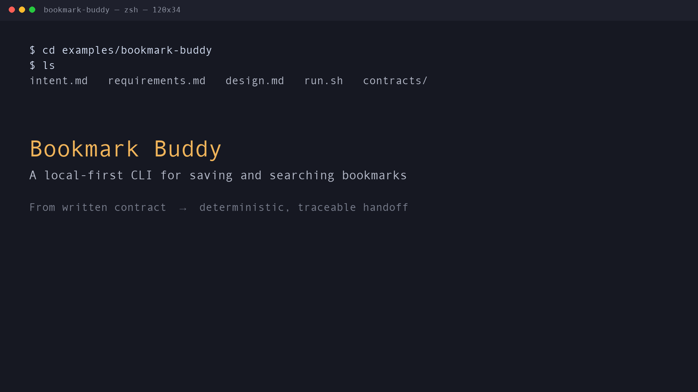

# Bookmark Buddy — Specadia Public Demo

This demo shows how Specadia turns a plain product intent into a traceable,
implementation-ready contract for a coding agent, in about two minutes, using
only deterministic, credential-free commands.

## Watch the two-minute demo

[](assets/specadia-bookmark-buddy-demo.mp4)

[Download the MP4](assets/specadia-bookmark-buddy-demo.mp4) ·
[Read the captions](assets/specadia-bookmark-buddy-demo.vtt) ·
[Follow the recording script](RECORDING.md)

## What it demonstrates

1. A short product [intent](intent.md) is distilled by a human into a
   hand-authored [requirements document](requirements.md) (the source of
   truth) and a [design document](design.md). These are the inputs Specadia
   consumes; the deterministic `generate` command below does not derive them
   from the intent itself.
2. `specadia-contract generate` converts those files into an
   [AGENTS.md contract](contracts/AGENTS.md) plus a
   [manifest](contracts/contract-manifest.json) that records the SHA-256 of
   every input and output — so reviewers can trace each emitted requirement to
   its source and confirm nothing was silently changed.

## Run the deterministic demo

The default entrypoint reproduces the contract generation twice into two fresh
output directories and proves the results are byte-for-byte identical:

```bash
./run.sh
```

Or point it at a specific `specadia-contract` binary:

```bash
SPECADIA=/path/to/bin/specadia-contract ./run.sh
```

The equivalent manual commands (deterministic, credential-free) are:

```bash
specadia-contract generate requirements.md \
  --design design.md \
  --harness codex \
  --output-dir contracts
```

Re-running into the same `--output-dir` refuses to overwrite (FileExistsError)
unless `--force` is supplied — matching how the CLI protects existing files.

## Optional live / human-in-the-loop path (requires `specadia[full]`)

Specadia also ships a *live* end-to-end path that turns intent into requirements
and design through interactive human-in-the-loop agents before generating the
contract. It is strictly optional and is **not** run in this demo, because it
requires the `specadia[full]` extras and a model:

```bash
python -m pip install "specadia[full]"
specadia-contract from-intent --help
```

The `from-intent` command needs an LLM and (for some hosted models) network
access. It is shown here only for reference; the deterministic demo above needs
neither.

## Artifacts

- [intent.md](intent.md) — the plain-English product intent.
- [requirements.md](requirements.md) — the SRS: purpose, functional and
  non-functional requirements, and acceptance criteria.
- [design.md](design.md) — architecture and file structure.
- [contracts/AGENTS.md](contracts/AGENTS.md) — the generated Codex contract
  (demo output; not a license to implement).
- [contracts/contract-manifest.json](contracts/contract-manifest.json) — source
  and output SHA-256 traceability.

For upstream context, see the Specadia project README (which mentions its
predecessor, READ-MAS).
